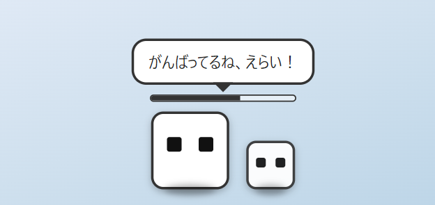
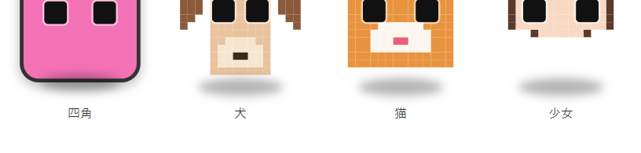

# desktop-pet

透明・常時最前面のデスクトップ常駐ペットアプリ（Electron製）。

白い四角+黒い目のシンプルなキャラクターが画面上を歩き回り、アクティブウィンドウ（作業中のアプリ）を検知してセリフを表示します。作業時間に応じてレベルアップし、一定レベルごとに子分（仲間）が増えていきます。




## 特徴

- **透明・常時最前面ウィンドウ**: どのアプリを使っていても画面の一番手前に表示されます。
- **アクティブウィンドウ検知**: エディタ・ブラウザ・ターミナルなど、使っているアプリに応じてセリフが変わります(頻度は最低45秒に1回程度に抑制)。
- **作業時間でレベルアップ**: 一定時間ごとにレベルが上がり、経験値バーで進捗が確認できます（操作していないアイドル時間はカウントされません）。
- **子分(仲間)システム**: レベルが上がると子分が増え、画面上のキャラの数も増えていきます。
- **自由に歩き回る**: 画面の下端を歩き回り、時々立ち止まったり方向転換したりします。`config.json` でON/OFFや速度を設定可能です。
- **持ち上げ→落下**: ドラッグで持ち上げて離すと、重力で地面まで落ちるアニメーションと足元の影が付きます。
- **色を変更**: 右クリックメニューから9色(レインボー含む)を無料で選べます。
- **見た目(スキン)を変更**: 四角のほか、犬・猫・少女のドット絵スキンを無料で選べます(右クリックメニュー「見た目を変える」)。

  
- **CPU/メモリ使用率で表情が変化**: PCの負荷が上がると目つきが変わります(口や眉は付けず、目の形だけで表現)。
- **状態の永続化**: 累計作業時間・色などはアプリを再起動しても引き継がれます。

## ダウンロード

Node.jsのインストールやコマンド操作なしで使いたい場合は、[Releases](https://github.com/ytatthan0616-debug/desktop-pet/releases) ページから、お使いのOS用のインストーラーをダウンロードしてください。

| OS | ファイル |
| --- | --- |
| Windows | `Desktop Pet Setup x.x.x.exe`（実行してインストーラーの案内に従うだけ） |
| macOS | `Desktop Pet-x.x.x.dmg`（開いてApplicationsフォルダにドラッグ） |
| Linux | `Desktop Pet-x.x.x.AppImage`（実行権限を付けて起動: `chmod +x` の後にダブルクリックまたは実行） |

インストール後はアプリ一覧（Windowsならスタートメニュー）から「Desktop Pet」を起動できます。

> Windows/macOSともに署名なしビルドのため、初回起動時に「発行元を確認できません」等の警告が出ることがあります。Windowsは「詳細情報」→「実行」、macOSは右クリック→「開く」で起動できます。

## 開発者向け: ソースから実行

- [Node.js](https://nodejs.org/) 18以降
- npm

```bash
git clone https://github.com/ytatthan0616-debug/desktop-pet.git
cd desktop-pet
npm install
npm start
```

起動すると、画面の右下あたりに小さな白いキャラが現れます。

- **ドラッグ**: キャラをクリックしたままドラッグすると好きな場所に移動できます。離すと重力で地面まで落ちます。
- **右クリック**: レベル・子分の数の確認、歩き回りのON/OFF切り替え、色の変更、データのリセット、終了ができます。

## 設定 (`config.json`)

プロジェクト直下の `config.json` を編集すると、保存と同時に（再起動なしで）設定が反映されます。
（インストーラー版の場合は、インストール先の `resources/config.json` が対象です。Windowsの既定インストール先は `%LOCALAPPDATA%\Programs\Desktop Pet\resources\config.json` です。）

```json
{
  "wander": true,
  "wanderSpeedPxPerSec": 55,
  "walkDurationMs": [2000, 6000],
  "idleDurationMs": [1200, 4000]
}
```

| キー | 説明 |
| --- | --- |
| `wander` | `true` で画面内を歩き回る、`false` でその場に留まる |
| `wanderSpeedPxPerSec` | 歩く速さ（ピクセル/秒） |
| `walkDurationMs` | 1回の「歩く」動作が続く時間の範囲（ミリ秒） |
| `idleDurationMs` | 1回の「立ち止まる」動作が続く時間の範囲（ミリ秒） |

右クリックメニューの「歩き回るのをやめさせる／歩き回らせる」からも切り替えられます（`config.json` に自動で保存されます）。

## レベルアップ・子分の仕様

- 30分の作業（アクティブ操作）ごとに1レベルアップします。
- 3レベルごとに子分が1匹増えます（最大8匹まで）。
- 進行状況は `src/petState.js` の定数（`SECONDS_PER_LEVEL` など）で調整できます。

## 表情(CPU/メモリ連動)

`os.cpus()` と `os.totalmem()/freemem()` から使用率を5秒おきにサンプリングし、負荷に応じて目の形が変わります(いずれもしきい値は `main.js` の `LOAD_BUSY_THRESHOLD` / `LOAD_STRESSED_THRESHOLD` で調整可能)。

| 使用率(CPU/メモリの高い方) | 表情 |
| --- | --- |
| 50%未満 | 通常 |
| 50%以上 | 目を細める |
| 80%以上 | 目を見開いて震える |

## プロジェクト構成

```
desktop-pet/
├── config.json          # ユーザー設定（歩き回りなど）
├── main.js               # メインプロセス（ウィンドウ管理・タイマー・IPC）
├── preload.js             # レンダラーへ安全にAPIを公開
├── src/
│   ├── petState.js        # レベル/子分の進行ロジック・永続化
│   ├── speech.js           # アクティブウィンドウ→セリフのマッピング
│   └── config.js            # config.json の読み書き・監視
└── renderer/
    ├── index.html
    ├── style.css            # キャラの見た目・アニメーション
    └── renderer.js
```

## インストーラーのビルド

[electron-builder](https://www.electron.build/) を使ってインストーラーを生成できます。

```bash
npm run dist:win    # Windows: NSISインストーラー(.exe)
npm run dist:mac    # macOS: .dmg（macOS上でのみ実行可能）
npm run dist:linux  # Linux: AppImage
```

生成物は `dist/` に出力されます（Gitには含まれません）。

### リリースの自動公開

`v` から始まるタグ（例: `v0.2.0`）をpushすると、GitHub Actions（`.github/workflows/release.yml`）がWindows/macOS/Linuxの3プラットフォームでビルドし、自動的に [Releases](https://github.com/ytatthan0616-debug/desktop-pet/releases) にインストーラーを公開します。

```bash
git tag v0.2.0
git push origin v0.2.0
```

## 既知の制限

- `active-win` によるアクティブウィンドウ検知は、macOSでは初回にアクセシビリティ権限の許可が必要な場合があります。
- 現状は単一ディスプレイ（プライマリディスプレイ）を前提にしています。
- キャラの見た目は白い四角+黒い目のみで、画像アセットは使用していません。
- 配布用インストーラーはコード署名をしていないため、初回起動時にOSの警告が表示されます（[ダウンロード](#ダウンロード)参照）。

## ライセンス

[MIT License](./LICENSE)
